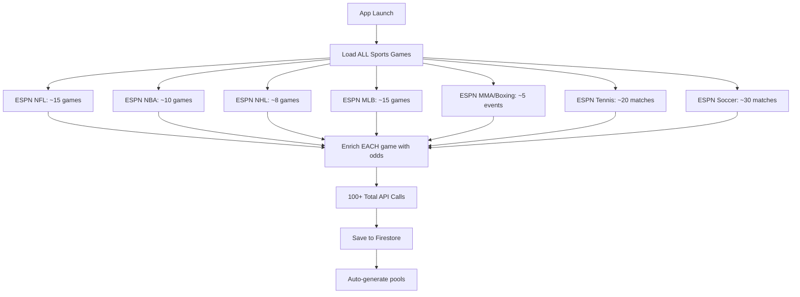

# API Optimization Plan - Bragging Rights App

## Current State Analysis

### Problem Summary
The app currently makes **100+ API calls on launch**, causing:
- Slow initial load times
- Excessive data usage
- Rate limiting risks
- Poor user experience
- Unnecessary Firebase costs

### Current API Call Flow



## Optimization Strategy

### Phase 1: Smart Loading Architecture

#### 1.1 Lazy Loading Pattern
```
App Start:
├── Authentication only
├── Load user preferences
├── Defer all game loading
└── Show UI skeleton immediately

Games Page:
├── Load ONLY user's preferred sports
├── Fetch ONLY top 5 featured games per sport
├── Implement infinite scroll for more games
└── Cache aggressively based on game state
```

#### 1.2 API Call Reduction
| Current | Optimized | Reduction |
|---------|-----------|-----------|
| Load all sports on start | Load preferred sports only | 70% fewer |
| Fetch all games per sport | Fetch top 5 featured | 80% fewer |
| Enrich all games with odds | Enrich on-demand | 90% fewer |
| No caching strategy | Smart TTL caching | 60% fewer |
| **Total: ~100 calls** | **Total: ~10 calls** | **90% reduction** |

### Phase 2: Implementation Details

#### 2.1 User Preferences System
```dart
// New file: lib/models/user_preferences.dart
class UserPreferences {
  final List<String> favoriteSports;  // ['nfl', 'nba']
  final List<String> favoriteTeams;   // ['Cowboys', 'Lakers']
  final bool showLiveGamesFirst;
  final bool autoLoadOdds;
  final int maxGamesPerSport;         // Default: 5
}
```

#### 2.2 Featured Games Algorithm
```dart
// Priority scoring for games
int calculateGamePriority(GameModel game) {
  int score = 0;
  
  // Live games get highest priority
  if (game.status == 'live') score += 1000;
  
  // Games starting soon
  final hoursUntilGame = game.gameTime.difference(DateTime.now()).inHours;
  if (hoursUntilGame <= 3) score += 500;
  
  // User's favorite teams
  if (userFavoriteTeams.contains(game.homeTeam) || 
      userFavoriteTeams.contains(game.awayTeam)) {
    score += 800;
  }
  
  // Games with active pools
  if (game.hasActivePools) score += 300;
  
  // Prime time games
  if (game.gameTime.hour >= 20) score += 100;
  
  return score;
}
```

#### 2.3 Smart Caching Strategy
```dart
// Cache TTLs based on game state
class CacheTTL {
  static const Map<String, int> ttlSeconds = {
    'pre_game_far': 3600,    // 1 hour for games > 24 hours away
    'pre_game_near': 600,    // 10 min for games < 24 hours away
    'pre_game_imminent': 60, // 1 min for games < 1 hour away
    'live_game': 30,         // 30 seconds for live games
    'post_game': 7200,       // 2 hours for completed games
  };
}
```

### Phase 3: Modified API Services

#### 3.1 Games Service Modifications

**PRESERVE these working endpoints:**
```dart
// ESPN Endpoints (all working, keep as-is)
'https://site.api.espn.com/apis/site/v2/sports/football/nfl/scoreboard'
'https://site.api.espn.com/apis/site/v2/sports/basketball/nba/scoreboard'
'https://site.api.espn.com/apis/site/v2/sports/hockey/nhl/scoreboard'
'https://site.api.espn.com/apis/site/v2/sports/baseball/mlb/scoreboard'
'https://site.api.espn.com/apis/site/v2/sports/mma/ufc/scoreboard'
'https://site.api.espn.com/apis/site/v2/sports/boxing/scoreboard'
'https://site.api.espn.com/apis/site/v2/sports/tennis/scoreboard'
'https://site.api.espn.com/apis/site/v2/sports/soccer/all/scoreboard'
```

**ADD query parameters for limiting:**
```dart
// Add limit parameter to reduce payload
final limitedUrl = '$baseUrl?limit=5';  // Only get top 5 games
```

#### 3.2 New Loading Methods

```dart
// In GamesService
Future<List<GameModel>> loadFeaturedGames({
  required List<String> sports,
  int maxPerSport = 5,
}) async {
  final games = <GameModel>[];
  
  // Only load requested sports
  for (final sport in sports) {
    final sportGames = await _loadSportGames(
      sport: sport,
      limit: maxPerSport,
    );
    games.addAll(sportGames);
  }
  
  // Sort by priority
  games.sort((a, b) => 
    calculateGamePriority(b).compareTo(calculateGamePriority(a))
  );
  
  return games;
}

// Lazy load more games
Future<List<GameModel>> loadMoreGames({
  required String sport,
  required int offset,
  int limit = 10,
}) async {
  // Implementation for pagination
}
```

#### 3.3 On-Demand Odds Enrichment

```dart
// In GameOddsEnrichmentService
Future<void> enrichGameOnDemand(String gameId) async {
  // Check cache first
  final cached = await _cache.getOdds(gameId);
  if (cached != null && !_isStale(cached)) {
    return cached;
  }
  
  // Single game enrichment only
  final game = await _firestore.collection('games').doc(gameId).get();
  if (game.exists) {
    await enrichGameWithOdds(GameModel.fromFirestore(game));
  }
}
```

### Phase 4: UI Updates

#### 4.1 Games Page Updates
```dart
// Modified games_page.dart
class GamesPage extends StatefulWidget {
  @override
  void initState() {
    super.initState();
    _loadFeaturedGames();  // Not ALL games
  }
  
  Future<void> _loadFeaturedGames() async {
    final prefs = await getUserPreferences();
    final games = await gamesService.loadFeaturedGames(
      sports: prefs.favoriteSports,
      maxPerSport: 5,
    );
    setState(() => _games = games);
  }
  
  // Add pull-to-refresh
  Future<void> _onRefresh() async {
    await _loadFeaturedGames();
  }
  
  // Add infinite scroll
  void _onScroll() {
    if (_scrollController.position.pixels >= 
        _scrollController.position.maxScrollExtent - 200) {
      _loadMoreGames();
    }
  }
}
```

#### 4.2 Game Selection Flow
```dart
// When user taps a game
Future<void> _onGameSelected(GameModel game) async {
  // Show loading indicator
  showLoadingDialog();
  
  // Enrich this specific game only
  await gameOddsService.enrichGameOnDemand(game.id);
  
  // Load pools for this game
  final pools = await poolService.getGamePools(game.id);
  
  // Navigate to pool selection
  Navigator.push(...);
}
```

### Phase 5: Progressive Enhancement

#### 5.1 Background Prefetching
```dart
// Prefetch likely next actions
class PrefetchService {
  // When user views NFL games, prefetch NFL odds in background
  Future<void> prefetchLikelyGames(String currentSport) async {
    // Low priority background fetch
    Timer(Duration(seconds: 2), () {
      _prefetchTopGamesForSport(currentSport);
    });
  }
}
```

#### 5.2 Intelligent Pool Generation
```dart
// Only generate pools for games with interest
class SmartPoolGenerator {
  Future<void> generatePoolsIfNeeded(GameModel game) async {
    // Check interest signals
    final hasUserFavorite = _involvesFavoriteTeam(game);
    final isPrimeTime = game.gameTime.hour >= 20;
    final isNearStart = game.gameTime.difference(DateTime.now()).inHours < 6;
    
    // Only generate if interest threshold met
    if (hasUserFavorite || (isPrimeTime && isNearStart)) {
      await _poolGenerator.generateGamePools(game);
    }
  }
}
```

## Implementation Checklist

### Priority 1 - Core Optimizations (Day 1)
- [ ] Create UserPreferences model and storage
- [ ] Modify GamesService to support limited fetching
- [ ] Implement featured games algorithm
- [ ] Add smart caching with TTLs
- [ ] Update Games page to lazy load

### Priority 2 - On-Demand Loading (Day 2)
- [ ] Modify odds enrichment to be on-demand
- [ ] Update game selection flow
- [ ] Implement pagination for more games
- [ ] Add pull-to-refresh functionality
- [ ] Test API call reduction

### Priority 3 - Progressive Enhancements (Day 3)
- [ ] Add background prefetching
- [ ] Implement smart pool generation
- [ ] Add user preference UI settings
- [ ] Optimize Firestore queries
- [ ] Add performance monitoring

## Rollback Plan

If optimization causes issues:

1. **Feature flag control:**
```dart
const bool USE_OPTIMIZED_LOADING = true;

if (USE_OPTIMIZED_LOADING) {
  return loadFeaturedGames();
} else {
  return loadAllGames();  // Original method
}
```

2. **Gradual rollout:**
- Test with one sport first (e.g., NFL only)
- Monitor performance metrics
- Expand to other sports gradually

3. **Keep original methods intact:**
- Don't delete existing code
- Add new methods alongside old ones
- Can switch back instantly if needed

## Success Metrics

### Target Improvements
| Metric | Current | Target | Measurement |
|--------|---------|--------|-------------|
| Initial load time | 8-10 seconds | 2-3 seconds | Timer from app start |
| API calls on launch | 100+ | 10-15 | Network monitor |
| Data usage | ~5MB | ~500KB | Network inspector |
| Time to betting screen | 15 seconds | 5 seconds | User journey timer |
| Cache hit rate | 20% | 80% | Cache analytics |

### Monitoring Plan
```dart
// Add performance tracking
class PerformanceMonitor {
  static void trackAPICall(String endpoint, int responseTime) {
    analytics.logEvent('api_call', {
      'endpoint': endpoint,
      'response_time_ms': responseTime,
      'cache_hit': false,
    });
  }
  
  static void trackCacheHit(String key) {
    analytics.logEvent('cache_hit', {
      'cache_key': key,
    });
  }
}
```

## Risk Mitigation

### Potential Issues & Solutions

1. **ESPN Rate Limiting**
   - Solution: Implement exponential backoff
   - Add request queuing system
   - Monitor 429 responses

2. **Cache Invalidation**
   - Solution: Version cache keys
   - Add manual cache clear option
   - Monitor cache staleness

3. **Missing Live Updates**
   - Solution: Increase polling for user's active bets
   - WebSocket fallback for critical games
   - Push notifications for score changes

4. **User Confusion**
   - Solution: Clear "Load More" indicators
   - Show sport tabs clearly
   - Add preference onboarding

## Code Preservation Notes

### DO NOT MODIFY These Working Components:
1. ESPN endpoint URLs (all working)
2. Odds data extraction logic (recently fixed)
3. Firebase authentication flow
4. Wallet transaction logic
5. Bet placement system

### Safe to Modify:
1. When/how many games are loaded
2. Caching strategies
3. UI loading states
4. Pool generation triggers
5. Background fetch timing

## Next Steps

1. Review this plan with team
2. Create feature branch: `feature/api-optimization`
3. Implement Priority 1 items
4. Test with small user group
5. Monitor metrics for 24 hours
6. Proceed with Priority 2 if metrics improve
7. Full rollout after 1 week testing

## Questions to Address

Before implementation:
1. What sports do most users actually bet on?
2. What's the current Firebase read/write costs?
3. Do we have user analytics on game selection patterns?
4. What's our ESPN API rate limit?
5. Should we add a paid tier with more real-time updates?